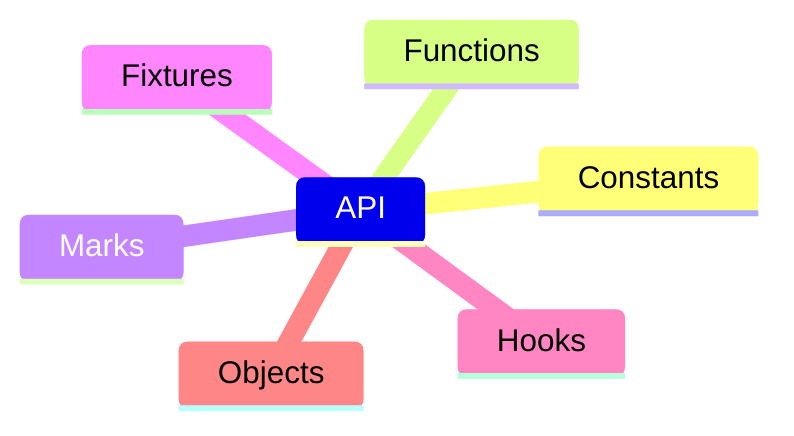
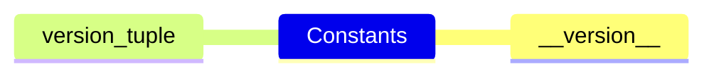
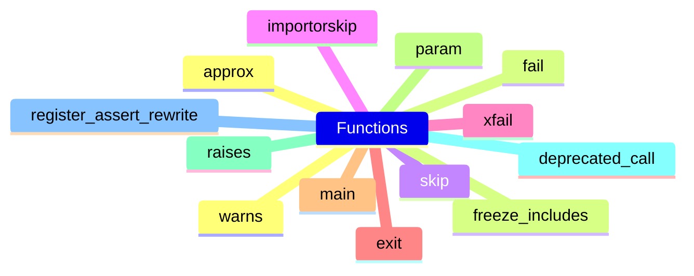
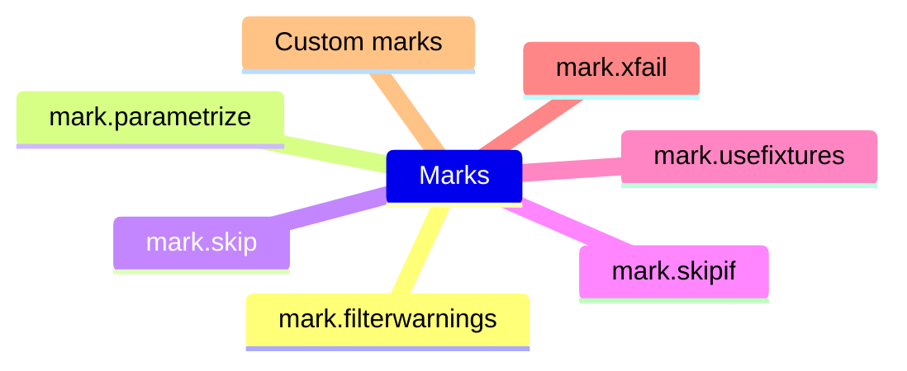
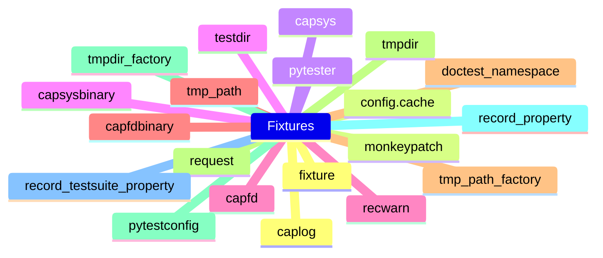
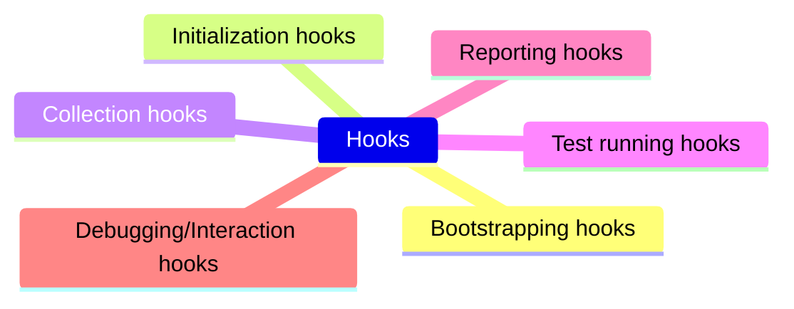
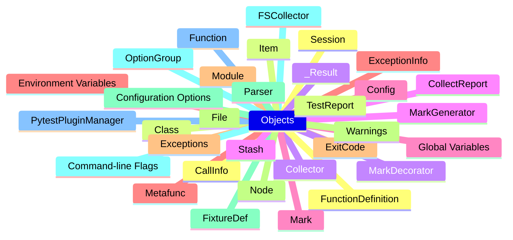

#### API Mindmap

```mermaid
mindmap
    API
        Constants
        Functions
        Marks
        Fixtures
        Hooks
        Objects
```

###### Constants

```mermaid
mindmap
    Constants
        \_\_version\_\_
        version_tuple
```

###### Functions

```mermaid
mindmap
    Functions
        approx
        fail
        skip
        importorskip
        xfail
        exit
        main
        param
        raises
        deprecated_call
        register_assert_rewrite
        warns
        freeze_includes
```

###### Marks

```mermaid
mindmap
    Marks
        mark.filterwarnings
        mark.parametrize
        mark.skip
        mark.skipif
        mark.usefixtures
        mark.xfail
        Custom marks
```

###### Fixtures

```mermaid
mindmap
    Fixtures
        fixture
        config.cache
        capsys
        capsysbinary
        capfd
        capfdbinary
        doctest_namespace
        request
        pytestconfig
        record_property
        record_testsuite_property
        caplog
        monkeypatch
        pytester
        testdir
        recwarn
        tmp_path
        tmp_path_factory
        tmpdir
        tmpdir_factory
```

###### Hooks

```mermaid
mindmap
    Hooks
        Bootstrapping hooks
        Initialization hooks
        Collection hooks
        Test running hooks
        Reporting hooks
        Debugging/Interaction hooks
```

###### Objects

```mermaid
mindmap
    Objects
        CallInfo
        Class
        Collector
        CollectReport
        Config
        ExceptionInfo
        ExitCode
        File
        FixtureDef
        FSCollector
        Function
        FunctionDefinition
        Item
        MarkDecorator
        MarkGenerator
        Mark
        Metafunc
        Module
        Node
        Parser
        OptionGroup
        PytestPluginManager
        Session
        TestReport
        _Result
        Stash
        Global Variables
        Environment Variables
        Exceptions
        Warnings
        Configuration Options
        Command-line Flags
```