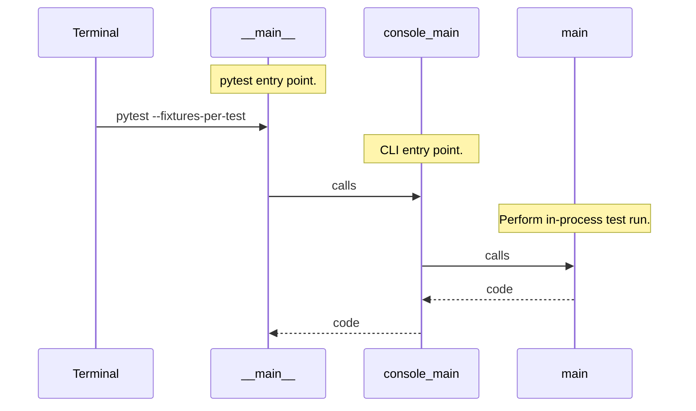

```mermaid
sequenceDiagram
  participant Terminal as Terminal
  participant __main__ as __main__
  participant console_main as console_main
  participant main as main

  note over __main__: pytest entry point.  
  Terminal ->> __main__: pytest --fixtures-per-test

  note over console_main: CLI entry point.
  __main__ ->> console_main: calls

  note over main: Perform in-process test run.  
  console_main ->> main: calls

  main -->> console_main: code
  console_main -->> __main__: code

```
