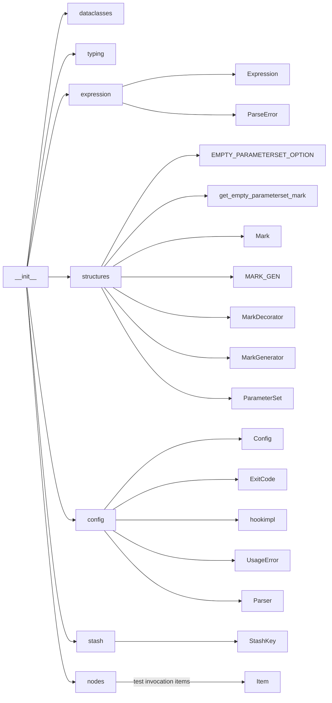

The `mark` package provides generic mechanisms for marking and selecting python functions.
It is located at `src/_pytest/mark`.

### Directory Structure
```
__init__.py
expression.py
structures.py
```
#### `__init__.py` structure
##### imports



