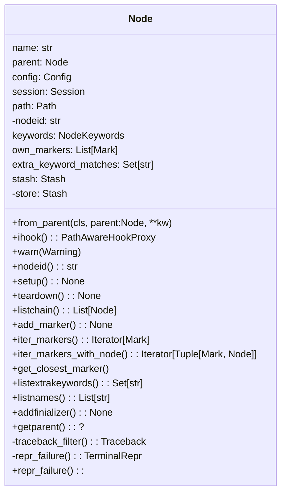

The base class of the components of pytest's collection tree.

```mermaid
classDiagram
 
class Node {
        name: str
        parent: Node
        config: Config
        session: Session
        path: Path
        -nodeid: str
        keywords: NodeKeywords
        own_markers: List[Mark]
        extra_keyword_matches: Set[str]
        stash: Stash
        -store: Stash
        +from_parent(cls, parent:Node, **kw)
        +ihook(): PathAwareHookProxy
        +warn(Warning)
        +nodeid(): str
        +setup(): None
        +teardown(): None
        +listchain(): List[Node]
        +add_marker(): None
        +iter_markers(): Iterator[Mark]
        +iter_markers_with_node(): Iterator[Tuple[Mark, Node]]
        +get_closest_marker()
        +listextrakeywords(): Set[str]
        +listnames(): List[str]
        +addfinializer(): None
        +getparent(): ?
        -traceback_filter(): Traceback
        -repr_failure(): TerminalRepr
        +repr_failure():
    }

```