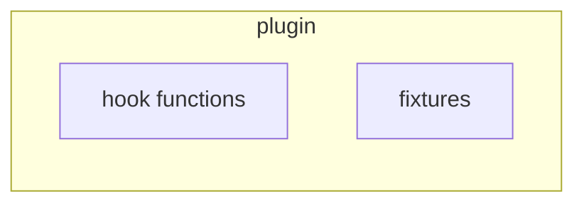
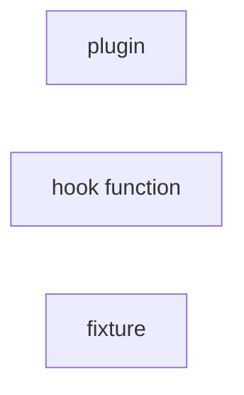

#### What are plugins?

*Okken* writes: 
The `conftest.py` file is treated as a 'local plugin' and can contain hook functions and fixtures. 

#### How do plugins relate to other objects?

#### Example Plugins
| name | source | access | summary|
| --- | --- | --- | ---- |
| cacheprovider | private | ? |

