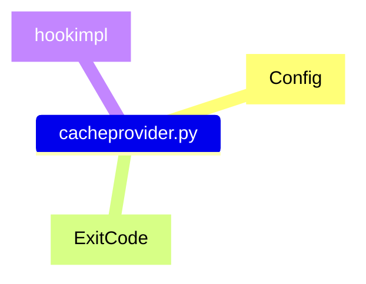

### [cacheprovider.py](https://github.com/pytest-dev/pytest/blob/main/src/_pytest/cacheprovider.py)

#### IMPORTS
|imports |source |
|--|---| 
|[pathlib](#pathlib)| [*/src/_pytest/pathlib.py*](https://github.com/pytest-dev/pytest/blob/main/src/_pytest/pathlib.py) |
|[reports](#reports)|[*/src/_pytest/reports.py*](https://github.com/pytest-dev/pytest/blob/main/src/_pytest/reports.py) |
|[_pytest](#_pytest)|[*/src/_pytest/*](https://github.com/pytest-dev/pytest/blob/main/src/_pytest)|
|[_pytest.config](#_pytestconfig)|[*/src/_pytest/config*](https://github.com/pytest-dev/pytest/tree/main/src/_pytest/config)|
|[_pytest.config.argparsing](#_pytestconfigargparsing)|[*/src/_pytest/config/argparsing*](https://github.com/pytest-dev/pytest/tree/main/src/_pytest/config/argparsing)|
|[_pytest.deprecated](#_pytestdeprecated)|[*/src/_pytest/deprecated*](https://github.com/pytest-dev/pytest/tree/main/src/_pytest/deprecated)|
|[_pytest.fixtures](#_pytestfixtures)|[*/src/_pytest/fixtures.py*](https://github.com/pytest-dev/pytest/tree/main/src/_pytest/fixtures.py)|
|[_pytest.main](#_pytestmain)|[*/src/_pytest/main.py*](https://github.com/pytest-dev/pytest/tree/main/src/_pytest/main.py)|
|[_pytest.nodes](#_pytestnodes)|[*/src/_pytest/nodes.py*](https://github.com/pytest-dev/pytest/tree/main/src/_pytest/nodes.py)|
|[_pytest.python](#_pytestpython)|[*/src/_pytest/python.py*](https://github.com/pytest-dev/pytest/tree/main/src/_pytest/python.py)|
|[_pytest.reports](#_pytestreports)|[*/src/_pytest/reports.py*](https://github.com/pytest-dev/pytest/tree/main/src/_pytest/reports.py)|
|[_pytest._io](#_pytestio)|[*/src/_pytest/io*](https://github.com/pytest-dev/pytest/tree/main/src/_pytest/_io) |

##### .pathlib

[source](https://github.com/pytest-dev/pytest/blob/main/src/_pytest/pathlib.py.py) | [go back](#imports)

##### .reports

[source](https://github.com/pytest-dev/pytest/blob/main/src/_pytest/reports.py.py) | [go back](#imports)

##### _pytest

[source](https://github.com/pytest-dev/pytest/blob/main/src/_pytest/nodes.py) | [go back](#imports)

##### _pytest.config

[source](https://github.com/pytest-dev/pytest/blob/main/src/_pytest/config) | [go back](#imports)

##### _pytest.config.argparsing

[source](https://github.com/pytest-dev/pytest/tree/main/src/_pytest/config/argparsing.py) | [go back](#imports)

##### _pytest.deprecated

[source](https://github.com/pytest-dev/pytest/tree/main/src/_pytest/deprecated.py) | [go back](#imports)

##### _pytest.fixtures

[source](https://github.com/pytest-dev/pytest/tree/main/src/_pytest/fixtures.py) | [go back](#imports)

##### _pytest.main

[source](https://github.com/pytest-dev/pytest/tree/main/src/_pytest/main.py) | [go back](#imports)

##### _pytest.nodes

[source](https://github.com/pytest-dev/pytest/tree/main/src/_pytest/nodes.py) | [go back](#imports)

##### _pytest.python

[source](https://github.com/pytest-dev/pytest/tree/main/src/_pytest/python.py) | [go back](#imports)

##### _pytest.reports

[source](https://github.com/pytest-dev/pytest/tree/main/src/_pytest/reports.py) | [go back](#imports)

##### _pytest._io

[source](https://github.com/pytest-dev/pytest/tree/main/src/_pytest/_io) | [go back](#imports)
