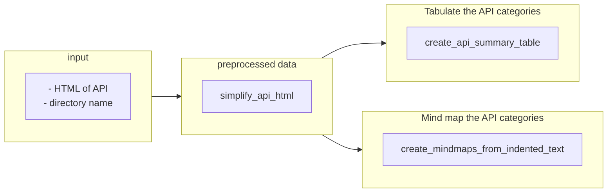

#### The Pipeline
Create the API documentation: a summary table and mindmaps.


#### Overview

Given

- the HTML of the API reference page
- a folder


the creation of a API documentation should include the following steps:

1. Simplify the HTML to make it easier to process.
2. Tabulate the API categories.
3. Mind map the API categories.


#### Example
##### Inputs
`directory name`: prompts
`description`: I write prompts and prompt pipelines here.
`motivation`: automation frees up higher-level thinking

##### Outputs
Creates the `prompts` directory and a minimal readme file:

```markdown
# /prompts/README.md

I write prompts and prompt pipelines here.
```

Adds an entry for it to the `/README.md` table of contents:

```markdown
# /README.md

| DIRECTORY                     | DESCRIPTION                                | MOTIVATION                                |
| ----------------------------- | ------------------------------------------ | ----------------------------------------- |
| [prompts](/prompts/README.md) | I write prompts and prompt pipelines here. | automation frees up higher-level thinking |
```