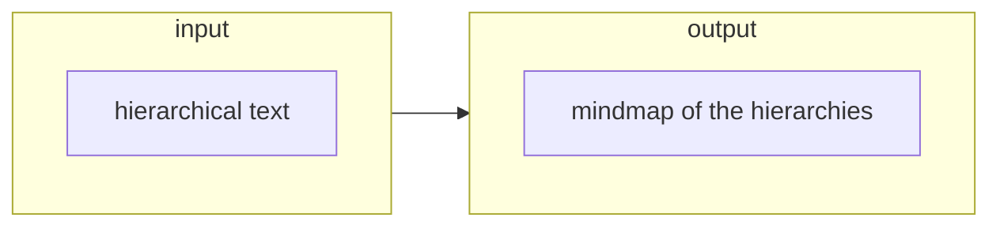
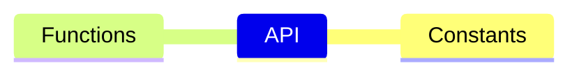
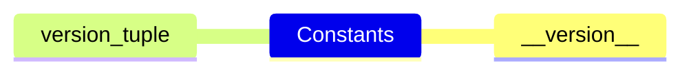
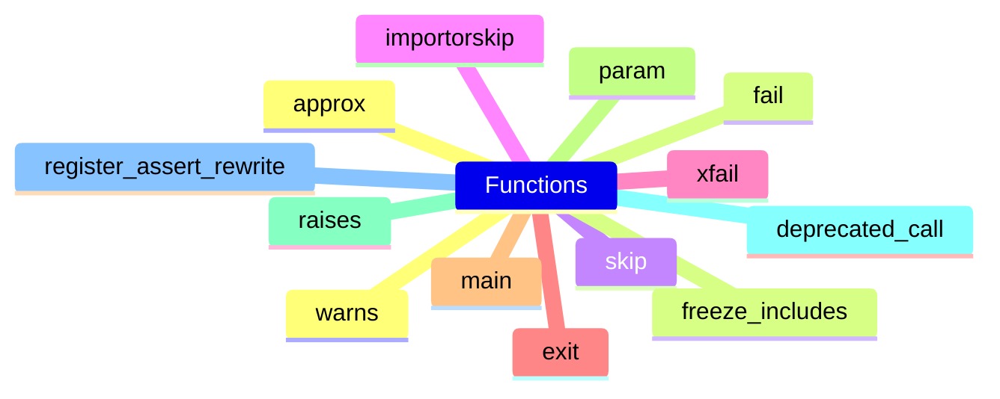

#### CONTEXT

#### INPUT
Constants
    pytest-version
    pytest-version-tuple
Functions
    pytest-approx
    pytest-fail
    pytest-skip
    pytest-importorskip
    pytest-xfail
    pytest-exit
    pytest-main
    pytest-param
    pytest-raises
    pytest-deprecated-call
    pytest-register-assert-rewrite
    pytest-warns
    pytest-freeze-includes
Hooks
    Bootstrapping-hooks
    Initialization-hooks
    Collection-hooks
    Test-running-runtest-hooks
    Reporting-hooks
    Debugging-Interaction-hooks

#### OUTPUT

##### API

###### Constants

###### Functions

